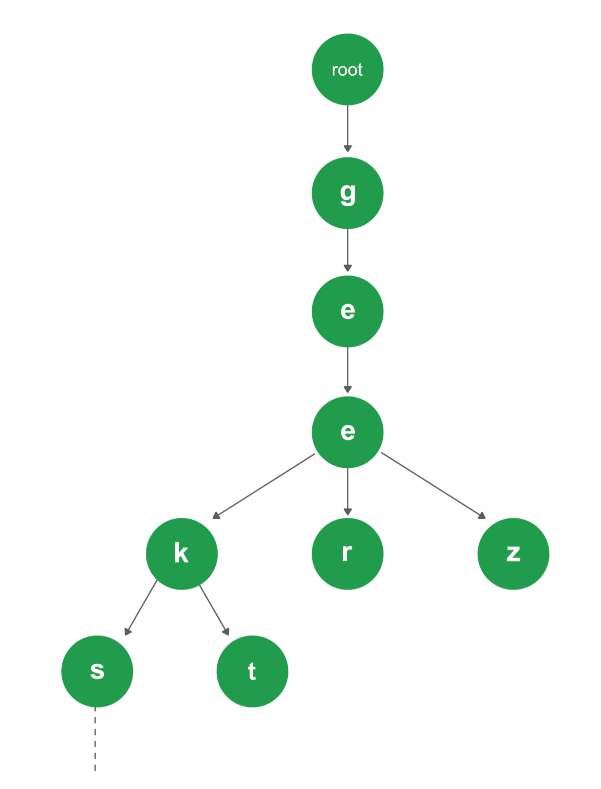

# Data-Structures-and-Problem-Solving
This is a repo that I design and hold different data structures and problems that are used in different interview processes.
In this project I am searching for different data structures and if I like their concept I am trying to implement them along with some programs that are using it.

### Trie Data structure 
**Trie** is a **tree** data structure that is used to store strings. The maximum number of children of a node is equal to the size of the alphabet. With Trie, we can insert and find strings in O(L) time where L represent the length of a single word. This is obviously faster than BST.

The trie program that I have made until now is a program that uses the trie functionality for creating, inserting, deleting and searching for words in a trie data structure. Following is a representation of a Trie Data structure.

<p align="center"> 
 
</p>


To run this program, be sure that you are in the Trie folder and then type:
```
make run
```


### Binary Search
In this folder I have implemented binary search using iteration and recursion. Then I have also implement a **hard** LeetCode problem that is used in different interviews and it's known as [Median Of Two Sorted Arrays](https://leetcode.com/problems/median-of-two-sorted-arrays) . Visit the site for more
